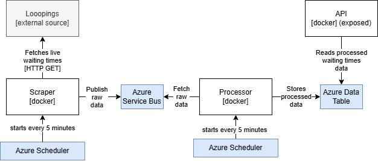

# Theme Park Waiting Times API (TPWT)

Theme Park Waiting Times API (TPWT) is an easy to use and free API to get up-to-date and historic (since 8-4-2025) waiting time data. It can be used for monitoring and analytical purposes.

## Try it out

TPWT is now live! Go to the [TPWT API](http://20.75.248.225:5000/apidocs/) page

## System level overview

TPWT consists of 3 main processes:

* **Scraper** - a web scraper that periodically fetches live waiting times from an external source
* **Processor** - processes the data and stores it on a persistent data base
* **API** - for interfacing with TPWT

## Open improvements

* User authorization, rate limiting
* More themeparks and rides supported
* More API data processing functions for different kinds of analytical purposes
* Ride name & theme park databases
* ARM templates for private deployment
* Tests & docs
